# 画像クレジット

| slot | プレビュー | 著者 | ライセンス | 出典 | 備考 |
|---|---|---|---|---|---|
| kemurigi | 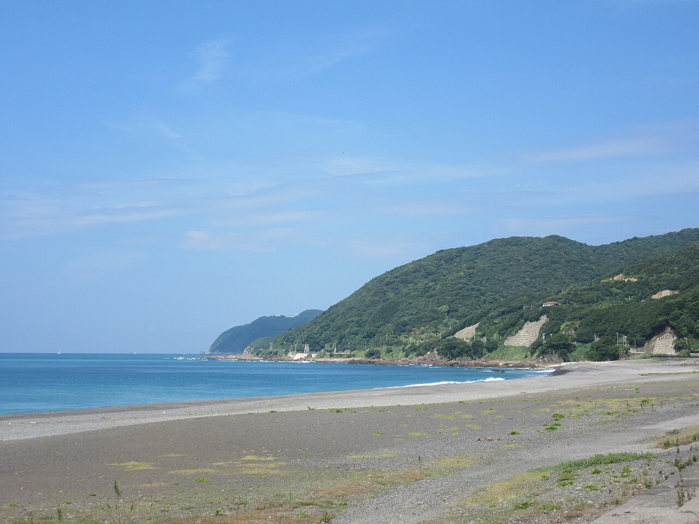 | Opqr | CC BY-SA 4.0 | [Wikimedia Commons](https://commons.wikimedia.org/wiki/File:Enjugahama.jpg) | 煙樹ヶ浜（御坊市〜美浜町）砂利浜の実写 |
| tanoura | 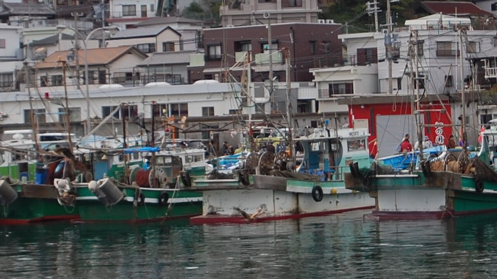 | Kasai noy | CC BY-SA 4.0 | [Wikimedia Commons](https://commons.wikimedia.org/wiki/File:Saikazaki_Fishing_harbor_(cropped).jpg) | 田ノ浦漁港代替：雑賀崎漁港（和歌山市） |
| fukahi | 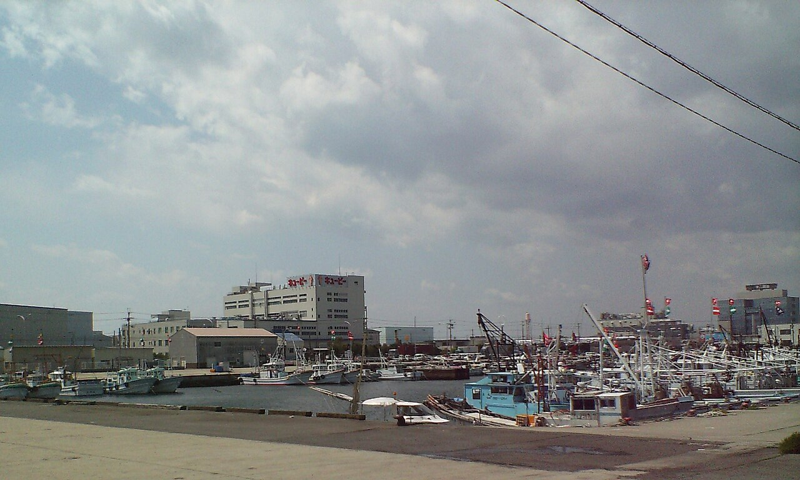 | 阪神強いな | CC BY-SA 3.0 | [Wikimedia Commons](https://commons.wikimedia.org/wiki/File:Izumisanoko001.JPG) | 深日港代替：泉佐野港（大阪府泉佐野市） |
| onsen | 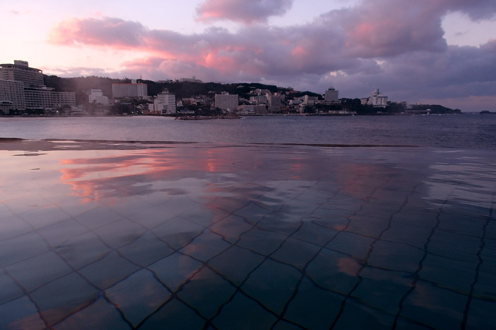 | 663highland | CC BY 2.5 | [Wikimedia Commons](https://commons.wikimedia.org/wiki/File:131221_Shirahama_Onsen_Shirahama_Wakayama_pref_Japan01s3.jpg) | みなべ・御坊温泉代替：白浜温泉（和歌山県） |
| minabe-lunch | 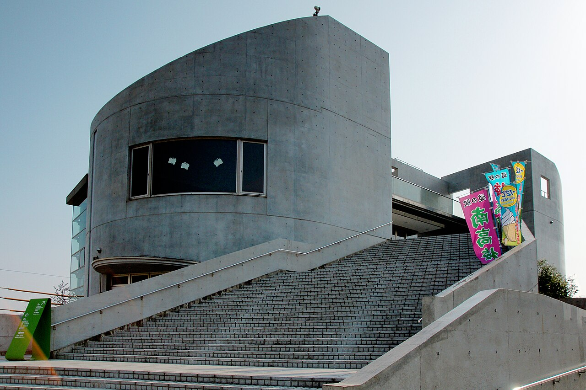 | 663highland | CC BY 2.5 | [Wikimedia Commons](https://commons.wikimedia.org/wiki/File:Minabe_Ume-shinkokan01n4272.jpg) | 道の駅みなべうめ振興館 外観 |
| aji-fishing | 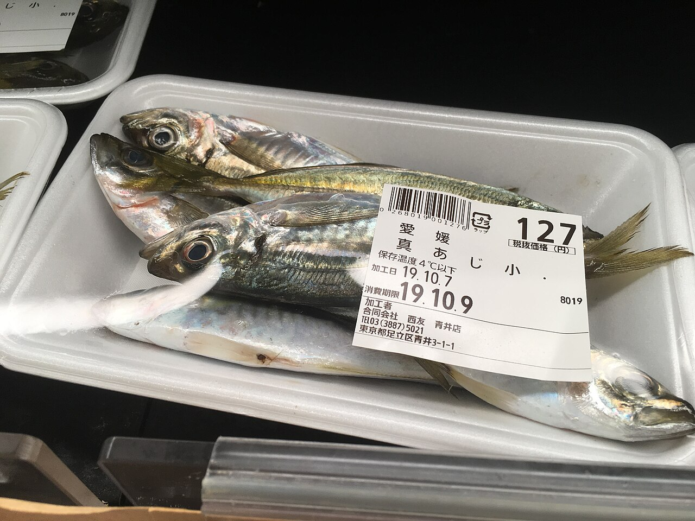 | Nesnad | CC BY 4.0 | [Wikimedia Commons](https://commons.wikimedia.org/wiki/File:Trachurus_japonicus_for_sale_in_Tokyo_area_-_Oct_7_2019.jpeg) | マアジ（Trachurus japonicus）実写・市場 |
| bbq | 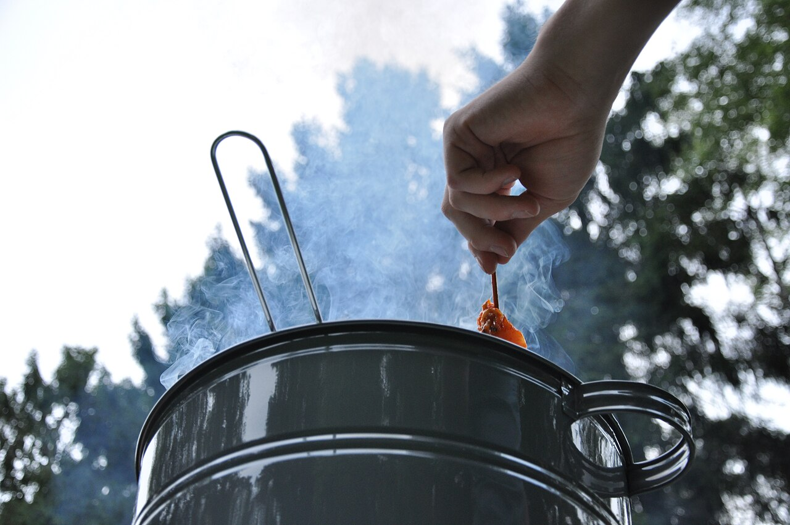 | Puikstekend | CC BY-SA 4.0 | [Wikimedia Commons](https://commons.wikimedia.org/wiki/File:Small_barbecue_in_the_forest,_Oisterwijk,_Netherlands,_July_2017.jpg) | 森の中でのバーベキュー（オランダ） |
| camp-river | 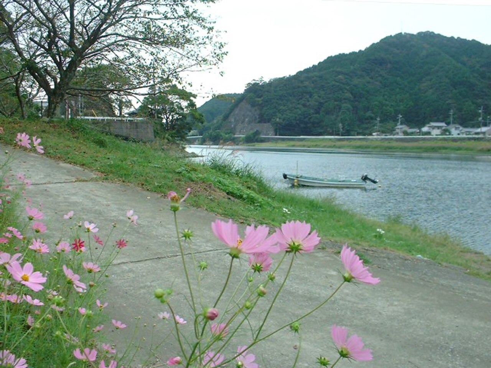 | Bakkai | CC BY-SA 3.0 | [Wikimedia Commons](https://commons.wikimedia.org/wiki/File:Kozagawa_Takaike.jpg) | 古座川・高池付近（和歌山県古座川町） |
| camp-tent | 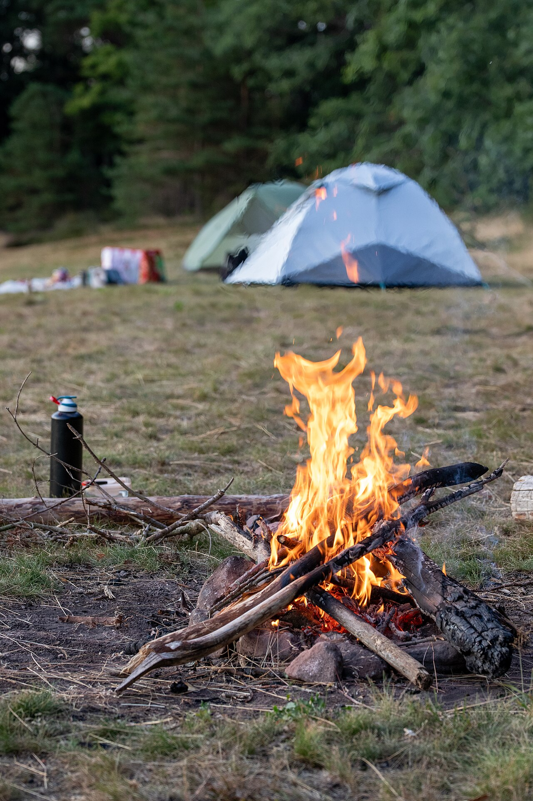 | Jygle | CC BY-SA 4.0 | [Wikimedia Commons](https://commons.wikimedia.org/wiki/File:Campfire_in_front_of_two_Bivouac_tents.jpg) | テントと焚き火のキャンプサイト |
| campfire | 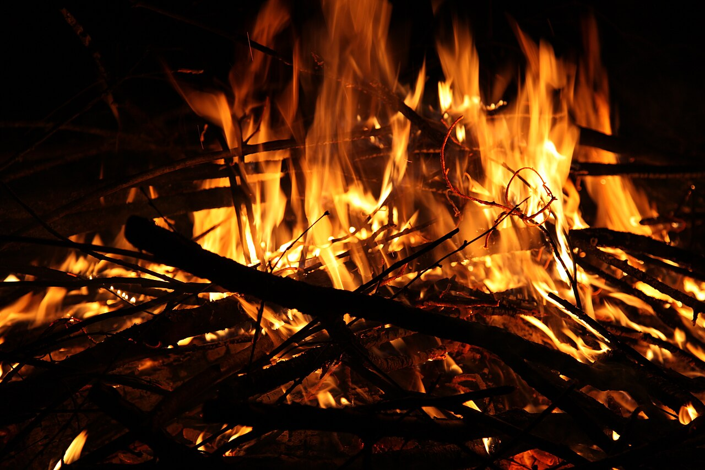 | Marc-Lautenbacher | CC BY-SA 4.0 | [Wikimedia Commons](https://commons.wikimedia.org/wiki/File:Campfire_flames_at_night.jpg) | 夜の焚き火・炎のクローズアップ |
| grilling | 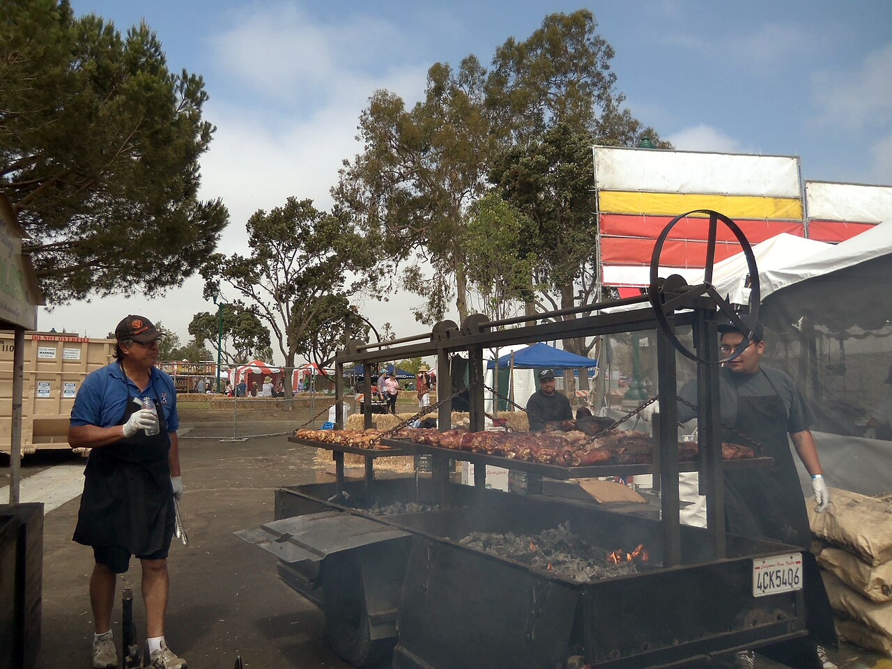 | Clotee Allochuku-Albritton | CC BY 2.0 | [Wikimedia Commons](https://commons.wikimedia.org/wiki/File:Barbecue_chicken_at_California_Strawberry_Festival_2012.jpg) | バーベキューチキン・炭火焼き |
| onsen2 | 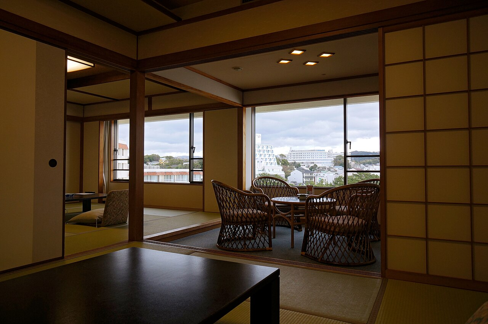 | 663highland | CC BY 2.5 | [Wikimedia Commons](https://commons.wikimedia.org/wiki/File:131221_Shirahama_Onsen_Shirahama_Wakayama_pref_Japan14s3.jpg) | 白浜温泉・別アングル（和歌山県白浜町） |
| onsen3 | 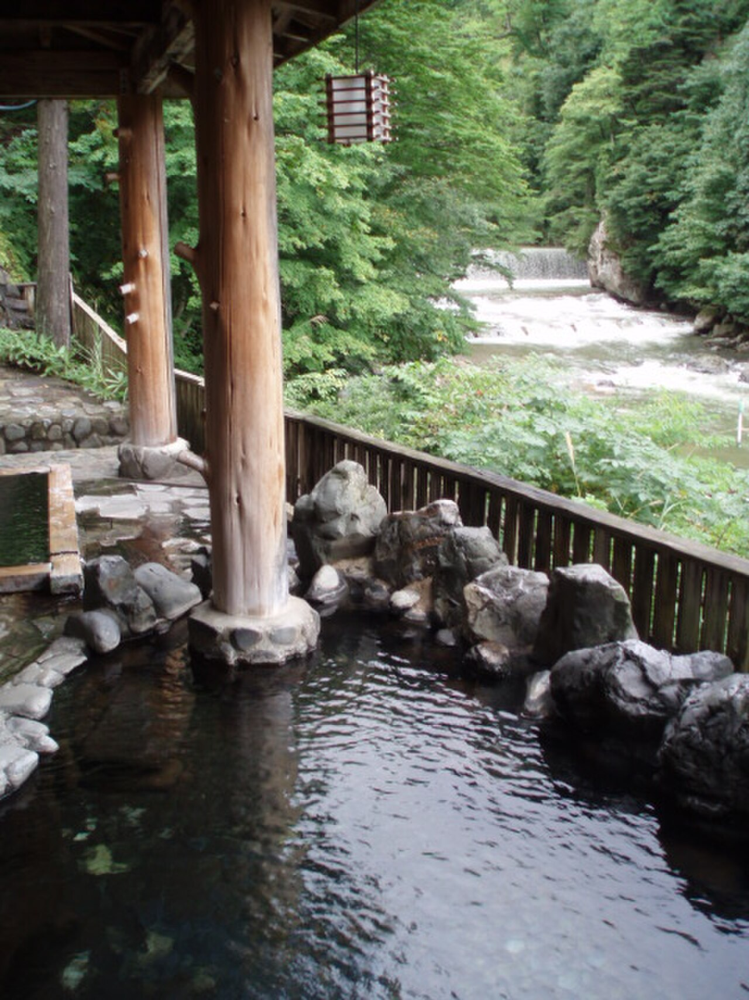 | RickardA | CC0 | [Wikimedia Commons](https://commons.wikimedia.org/wiki/File:Takanoyu_Onsen_Rotenburo_003.JPG) | 鷹ノ湯温泉露天風呂（和歌山内湯の代替） |
| fishing-port | 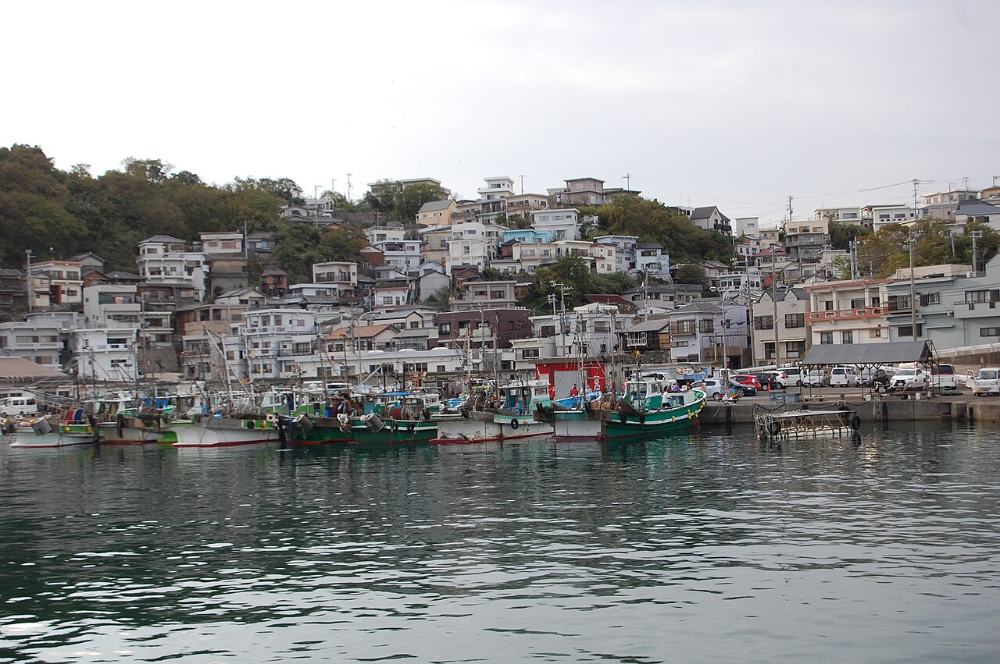 | Kasai noy | CC BY-SA 4.0 | [Wikimedia Commons](https://commons.wikimedia.org/wiki/File:Saikazaki_Fishing_harbor.jpg) | 雑賀崎漁港（和歌山市）。串本・古座港の代替。1280x851px |
| sea-wakayama | 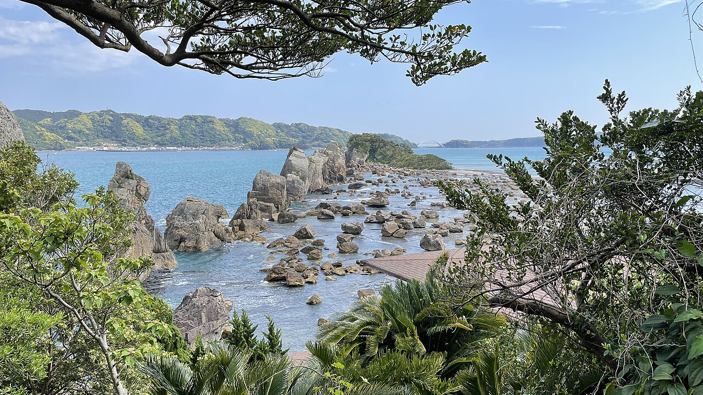 | NAKAJI | CC BY 4.0 | [Wikimedia Commons](https://commons.wikimedia.org/wiki/File:Wakayama-hashiguiiwa-xl.jpg) | 橋杭岩（串本町）。熊野灘の奇岩群・串本海岸風景。1280x720px |

## 代替使用の理由

- **田ノ浦漁港**（和歌山市）: Wikimedia Commons に該当写真なし。同市内の雑賀崎漁港（CC BY-SA 4.0）を代替使用。
- **深日港**（大阪府泉南郡岬町）: Wikimedia Commons に港の写真なし（駅舎写真のみ）。同府内の泉佐野港（CC BY-SA 3.0）を代替使用。
- **御坊・みなべ温泉**: Wikimedia Commons に該当写真なし。和歌山県を代表する温泉地・白浜温泉（CC BY 2.5）を代替使用。
- **アジ釣り/サビキ釣り**: 漁港でのサビキ釣りシーンの写真はCC適合なし。市場で販売中のマアジ実写（CC BY 4.0）を代替使用。
- **onsen3（内湯・大浴場）**: 和歌山県内の大浴場写真はWikimedia Commonsに未収録。秋田県の鷹ノ湯温泉露天風呂（CC0）を代替使用。
- **fishing-port（串本・古座港）**: Wikimedia Commonsに串本港・古座港の単体写真なし。同じ和歌山県内の雑賀崎漁港（CC BY-SA 4.0）を代替使用。
- **sea-wakayama（串本の海）**: 橋杭岩（Hashigui-iwa）は串本町の代表的景勝地であり、熊野灘・串本エリアの海岸風景として直接使用可（CC BY 4.0）。
